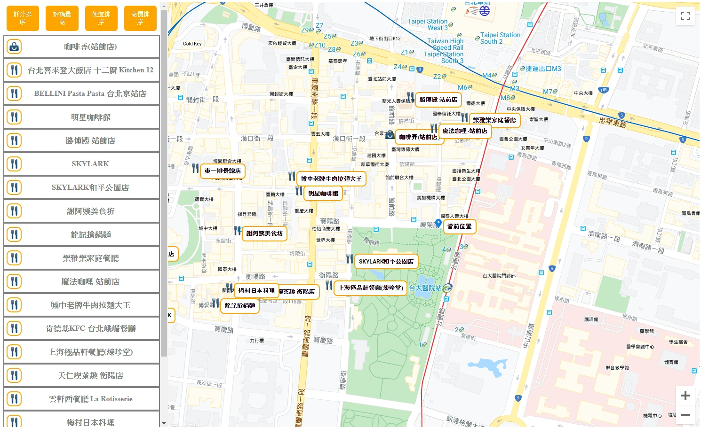

# 七天打造自己的 Google Map 應用入門 - Day00

## 前言

前陣子逛誠品書局的時候，看到一本由 Bill Kilday 所編撰的《Google 地圖革命》，讀了前 50 頁之後，了解原來 Google Map 的興起在最初也是一間名為 Keyhole 的新創公司的產品，之後才被 Google 所收購，幾經開發後才成為我們現在所熟知的 Google Map。

在書中開頭有寫道，Google Map 的出現，讓我們這代人成為人類史上最後一個會迷路的世代，也從這個世代開始，我們將不再迷路。

身為一個剛入行的菜鳥前端，Google Map API 串接對我來說的確是相當好的練習工具，不論是僅僅使用 Vanilla JavaScript，或者使用 Framework 開發皆是。

由於目前較常使用 React.js，所以這次打算介紹如何用 React.js 開發屬於自身的 Google Map 程式應用，搭配的套件則是 [Google-Map-React](https://github.com/google-map-react/google-map-react)。

## 七天內，我們會做什麼

其實我也不知道，因為我是第一次寫這類的系列挑戰，所以對哪一天要編寫哪一個部分，沒有什麼想法。

但七天內我們至少會做出一個地圖應用，也就是可以讓你搜尋附近你想搜尋的地標，如餐廳、咖啡廳，或者是廁所之類的。

雖然聽起來超級陽春，但基於這樣的基礎之下，你可以開發更多更強大的功能，因為當初使用 Google-Map-React 時並不清楚它的運作原理，所以花了很多時間研究，中文資料也相當匱乏，才促使我寫下這篇入門文章。

所以大概成品會長得大概像這樣，這是我之前做的一個小小練習:

儘管不是很確定哪一天要排哪一個部分，但若真要以天數做區別的話，我大概是這樣編排的：

- Day01- 申請 API Key 與 google map react 簡介
- Day02- 先讀懂該讀懂的部分
- Day03- 設定中心點與搜尋半徑 / 內容
- Day04- 將搜尋內容轉為 Marker 並放在地圖上
- Day05- 製作一個 Menu
- Day06- 製作排序功能
- Day07- 課程總結與反思

註：上面的內容有變動的可能

## 這篇文章適合誰

剛讀完 React 官方文件，但還沒有做過一個小作品，又恰巧想要了解一下 Google Map 應用的人。

## 備註

關於此系列文章會用到的套件功能僅僅是 google-map-react 的部分而已，有興趣的開發者可以讀看看此套件的文件，裡面有很多的範例應用參考。

第一次寫文章難免有錯誤與概念不對的部分，還請各位讀者多多包涵，大感謝！
