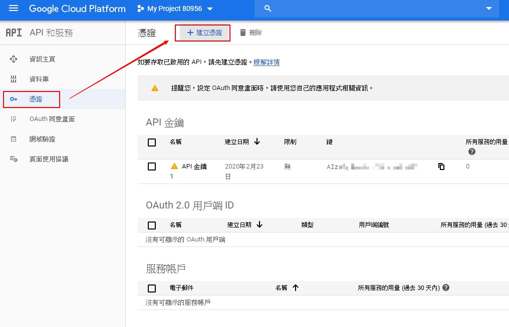

# 七天打造自己的 Google Map 應用入門 - Day01

## Day01 簡介

作為系列文開始的第一篇，今天我們要先準備一些在開發時會用到的文件與套件，除此之外，還有最重要的 API KEY

----

## API KEY　的申請

API KEY 的申請可以先到 [Google 地圖網站](https://cloud.google.com/maps-platform/)，登入後並開始使用地圖功能，點選畫面中間的「開始使用」之後就會彈出一個視窗，選擇我們要使用的部分。


原則上這次學習會用到的就是基本的**地圖介面集**與**地點介面集**，以地點介面集來說，我們可以利用它來搜尋附近的餐廳、咖啡廳等等的地標，所以我們需要用到它。

按下繼續之後，它會替你創建一個新專案，如果你是第一次使用 Google Cloud Platform，會有帳單等等設定。

但初次使用 Google Map API 是有免費使用額度的，所以就先放心開創專案吧！開啟專案之後，就可以看到 DashBoard，點選 API 的部分，這個頁面會顯示你所使用的 API 現況，包括你發出了多少次 Request，用了多少流量，在這邊都可以看到曲線圖般的統計。


點進去之後，看看我們的 API 清單，發現沒有我們剛剛的 Google Map API，沒關係，我們可以在這個頁面自己加進去。


點選上方的啟用 API　和服務，我們加入兩個 API，一個是 Maps JavaScript API，另一個則是 Places API，使用搜尋列就可以找到。

加入 API 之後，回到 API 資訊列，點選左邊 Menu 的**憑證**，再點選上方的**建立憑證**，選擇 API 金鑰，並保管好不要外洩，有了這一組 Key，我們就能使用剛剛我們加入的功能，在程式中串接相關的 API。



----

## 開始 React 專案

接下來是程式的部分，我們簡易使用 CRA (Create-React-App) 來建立我們的專案

```cli
npx create-react-app map
```

跑完之後，點進去 `src`，建立一個名為 `key.js` 的檔案，並 `export` 出去，供我們之後的專案使用，這麼做的重點是除了可以將 Key 本身獨立成一個檔案以外，還可以在之後 Push 專案前將其納入 `.gitignore` 之中，避免上傳到 GitHub 上。

順帶一提，先前我在練習時還真的忘記納入 `.gitignore`，上傳到 GitHub 之後被偵測到，而 Google 這邊在偵測到之後就自動將這個已曝光的 Key 失效，換成新的 Key，可見 Google 還算是蠻智慧的 XD

放入 key.js 之後，就可以來慢慢建立我們的專案了，在現下專案架構還很小時，我們可以先在 App.js 底下撰寫我們的程式碼，但在這之前，我們需要先安裝 `google-map-react` 這個套件，注意不是 `google-maps-react` 這個套件哦，兩者差了一個 `s`

```cli
npm install google-map-react -s
```

跑完之後，可以點進來看 [Google-map-react](https://github.com/google-map-react/google-map-react) 的相關介紹，在 Getting started 這個標題底下，看到範例程式碼，我們將它複製到我們的 App.js 底下，接下來會對程式碼一一做簡單的講解。


現在來看看我們的 App.js 會長怎樣:

```javascript
import React, { Component } from 'react';
import { Key } from './key' // 引入 API key
import GoogleMapReact from 'google-map-react';

const AnyReactComponent = ({ text }) => <div>{text}</div>;

// Map
class SimpleMap extends Component {
  static defaultProps = {
    center: {
      lat: 59.95,
      lng: 30.33
    },
    zoom: 11
  };

  render() {
    return (
      // Important! Always set the container height explicitly
      <div style={{ height: '100vh', width: '100%' }}>
        <GoogleMapReact
          bootstrapURLKeys={{ key: Key }}
          defaultCenter={this.props.center}
          defaultZoom={this.props.zoom}
        >
          <AnyReactComponent
            lat={59.955413}
            lng={30.337844}
            text="My Marker"
          />
        </GoogleMapReact>
      </div>
    );
  }
}


// App
function App() {
  return (
    <div className="App">
      <SimpleMap />
    </div>
  );
}

export default App;
```

我們現在有 `SimpleMap` 這個 Component，並把它放在 `App` 底下

而 `SimpleMap` 裡面又有 `GoogleMapReact`，這個 Component，這是 `google-map-react` 套件給我們的，你可以想像這個 `GoogleMapReact` 就是地圖本身，而裡面的 `AnyReactComponent` 則是地圖上的 Marker，也就是地圖釘的意思。

```javascript
<GoogleMapReact
  bootstrapURLKeys={{ key: Key }}　// API Key
  defaultCenter={this.props.center} // 預設地圖視角，也就是我一打開會先看到哪個地區
  defaultZoom={this.props.zoom} //　預設縮放視角
>
  <AnyReactComponent
  lat={59.955413} //　緯度
  lng={30.337844} // 經度
  text="My Marker"　// 這個 Marker 的文字
  />
</GoogleMapReact>

```

在範例中，預設地圖視角與縮放大小直接在 `defaultProps` 中給定義好了：

```javascript
static defaultProps = {
  center: {
    lat: 59.95,
    lng: 30.33
  },
  zoom: 11
};
```

順帶一提，`defaultProps` 這個用法可以預設 Props 的值，若父組件沒有傳 Props 下來，Props 則取用 `defaultProps` 中的值。

大概理解上述介紹之後，相信可能還有點模糊，所以我們直接 `npm start`，看看現在看起來會是什麼樣子：


套用剛剛的的 Component 解說，可以看成：


視角之所以在聖彼得堡，是因為 `defaultProps` 中的 `center` 經緯度分別在 `30.33` 與 `59.95` 的緣故，所以我們來查一下台灣這邊的經緯度，假設我想要定點在西門町，就來查一下西門町的經緯度，而我們一般使用 Google Map 時，其實視角的經緯度就會在我們的 URL 之中：


所以我們修改一下 `defaultProps`

```javascript
static defaultProps = {
  center: {
    lat: 25.04,
    lng: 121.50
  },
  zoom: 17 // 順便也放大一下縮放視角
};
```


可以看到我們的預設視角就會是西門町了，也因為視角放大到了 17，也可以更清楚看見街道與路名。

然而相比我們習慣使用的 Google Map 而言，地圖上可以說是空無一物，所以可以理解，原本我們使用地圖上的那些 Marker 與 Menu 等資訊，都是之後才加到地圖上的，不是地圖本身會自己產生的。

理解這一點之後，其實你就可以打造各式各樣你想在地圖上的標記，或者是你想要的功能等等，再搭配上述範例中 `AnyReactComponent` 的寫法，我們可以放任何 Marker 在地圖上的任何位置。

今天的分享文就到這邊，如果有描述錯誤的部分，請各位還不吝指教，相當感謝!
