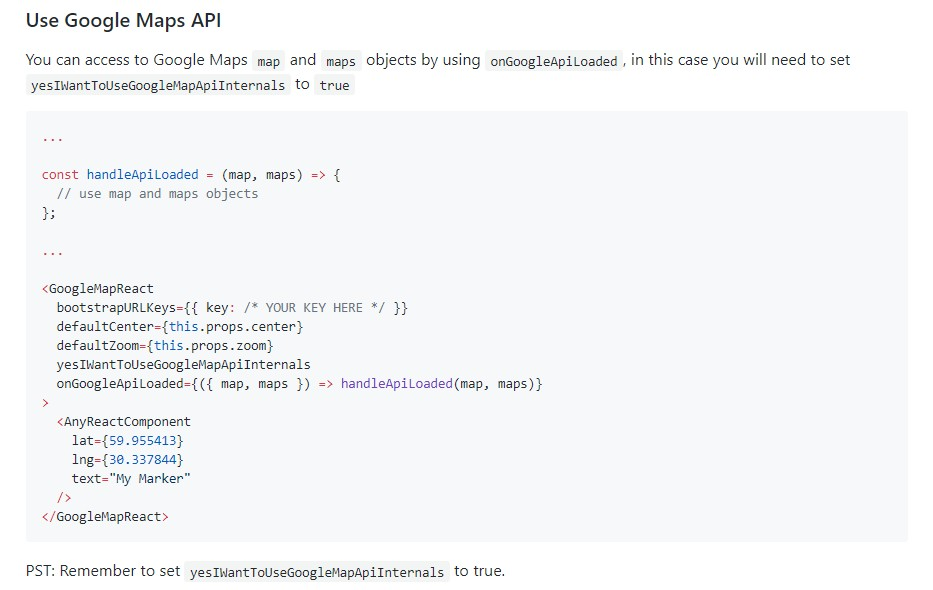
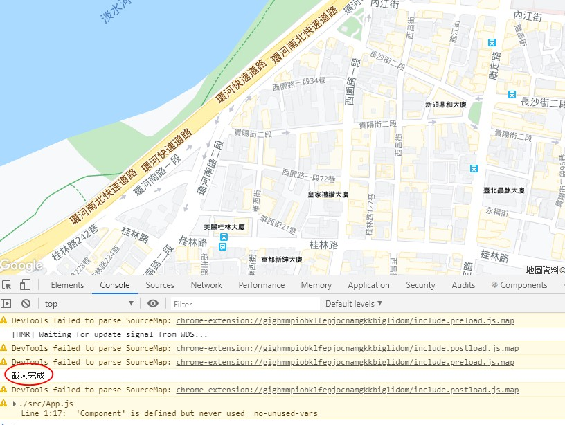
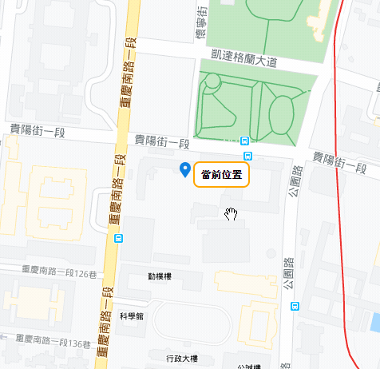

# 七天打造自己的 Google Map 應用入門 - Day02

## Day02 簡介

在 Day01 的時候，我們已經做好地圖樣板了，而接下來兩天我們要更進一步的搜索附近的地標。

而在 Day02 的部分，我們要先了解 google-map-react 套件的運作原理與如何透過套件幫我們寫好的語法，來取用 Google Map API。

一般而言，假設我們今天不用任何套件，直接使用原生 JavaScript 串地圖 API，那麼我們直接查文件就好:

[Map JavaScript API Docs](https://developers.google.com/maps/documentation/javascript/tutorial)

但其實很多情況是我們一邊使用 google-map-react 開發，一邊查閱文件，或是到 Stackoverflow 尋求解答，而尋求解答時拿到的範例程式碼卻又不知如何套用在 React 的寫法裡面。

所以這邊就會結合該如何透過 google-map-react 給我們的 API 去串接我們想要的功能，這也是我會想撰寫此篇系列文的原因。

在這邊系列文當中，你會看到一些蠻菜的程式碼，但至少你可以快速搞懂 google-map-react 與 Google Map API 大致上是如何運作的。

## 在 google-map-react 套件中啟用 Google Map API

閱讀 google-map-react 的 [README.MD](https://github.com/google-map-react/google-map-react)，裡面對於啟用 Google Maps API 的方法是這樣的:



我們直接修改我們的 `SimpleMap` :

```javascript
const SimpleMap = (props) => {
  const handleApiLoaded = (map, maps) => {
    // use map and maps objects
    console.log('載入完成!') // 印出「載入完成」
  };
  
  return (
    // Important! Always set the container height explicitly
    <div style={{ height: '100vh', width: '100%' }}>
      <GoogleMapReact
        bootstrapURLKeys={{ key: Key }}
        defaultCenter={props.center}
        defaultZoom={props.zoom}
        yesIWantToUseGoogleMapApiInternals // 設定為 true
        onGoogleApiLoaded={({ map, maps }) => handleApiLoaded(map, maps)} // 載入完成後執行
      >
        <AnyReactComponent
          lat={59.955413}
          lng={30.337844}
          text="My Marker"
        />
      </GoogleMapReact>
    </div>
  );
}

// 由於改寫成 functional component，故另外設定 defaultProps
SimpleMap.defaultProps = {
  center: {
    lat: 25.04,
    lng: 121.50
  },
  zoom: 17
};
```

要在 `google-map-react` 載入 Google Maps API，有兩件事情要做:

- 第一件事情是將 `yesIWantToUseGoogleMapApiInternals` 設為 `true`

- 第二件事情是寫一個 function 放入 `onGoogleApiLoaded`，裡面有 `map` 與 `maps` 兩個參數，我們可以在這個 function 裡面執行其他方法，做我們想做的事。

關於 `map` 與 `maps`，待會兒會解說這兩個參數代表什麼意思。

但從概念上來說，我們可以知道運行的順序是:

> Map Component 載入完成 -> onGoogleApiLoaded is OK -> 執行我們想做的事 (handleApiLoaded)

於是乎我們先嘗試在 handleApiLoaded 這個 Function 裡面寫一些 code，確定 API 載入完成後，確實有執行到這個 Function :

```javascript
const handleApiLoaded = (map, maps) => {
    // use map and maps objects
    console.log('載入完成!') // 印出「載入完成」
  };
```

重新整理，可以在開發者工具這邊看到 Console 出現「載入完成」



---

## 設定「我的位置」

在這次的系列文中，我們要做出一個可以搜尋附近地標的小程式，

所以我們的思考邏輯是:

> 確定「我的位置」 -> 就「我的位置」為基準，向外搜尋 -> 搜尋到方圓半徑內我們要找的目標

在理想的狀況下，我希望我移動地圖時，「我的位置」永遠都在地圖的正中間，像是這樣:



如果我的位置，也就是上圖的「當前位置」可以移動時更新，那麼我就只要在移動時重新搜尋附近的地標就好了

記得在 Day01 中的 `AnyReactComponent` 嗎 ? 它會以 Marker 的形式出現在地圖上

我們可以在 GoogleMapReact 裡面包一個 `MyPosition` 當作我們的 Marker，然後每移動一次地圖，觸發事件時 `setState(新的經緯度)` ，就可以變更 `MyPosition` 的位置。

而這個新的經緯度，也就是地圖的正中心點的座標，只要拿得到，就可以完成我們在移動時更新 `MyPosition` 的目的

那要如何取得地圖正中心點的座標呢? 這邊就要先提一下稍早的兩個參數 `map` 與 `maps`

- `map` 這個參數是個物件，指的其實就是我們現在看到的這張地圖，如果要取得這張地圖的資訊，就需要取得這個物件的資訊或方法來使用

- `maps` 也是一個物件，它指的是 Google Maps API，裡面有許多我們可以調用的方法，我們可以利用它來使用搜尋附近的地標資訊等等

既然要取得地圖正中心點的座標，我們就需要取得 map 之中的資訊，但由於 map 與 maps 之後都會用到，所以我將他們都放在 state 之中，供之後使用

所以我們修改一下程式碼:

```javascript
// 我的位置
const MyPositionMarker = ({ text }) => <div>{text}</div>;

const SimpleMap = (props) => {

  // 預設位置
  const [myPosition, setMyPosition] = useState({
    lat: 25.04,
    lng: 121.50
  })

  const [mapApiLoaded, setMapApiLoaded] = useState(false)
  const [mapInstance, setMapInstance] = useState(null)
  const [mapApi, setMapApi] = useState(null)

  // 當地圖載入完成，將地圖實體與地圖 API 傳入 state 供之後使用
  const apiHasLoaded = (map, maps) => {
    setMapInstance(map)
    setMapApi(maps)
    setMapApiLoaded(true)
  };
  
  return (
    <div style={{ height: '100vh', width: '100%' }}>
      <GoogleMapReact
        bootstrapURLKeys={{ key: Key }}
        defaultCenter={props.center}
        defaultZoom={props.zoom}
        yesIWantToUseGoogleMapApiInternals
        onGoogleApiLoaded={({ map, maps }) => apiHasLoaded(map, maps)}
      >
        <MyPositionMarker
          lat={myPosition.lat}
          lng={myPosition.lng}
          text="My Position"
        />
      </GoogleMapReact>
    </div>
  );
}
```

看到我們的地圖上有 My Marker 了，因為我設定它的位置 `myPosition` 為 `{ lat: 25.04, lng: 121.50 }`，與地圖一樣，

接下來寫一個 Function，用來處理移動事件發生時重新更新 `myPosition` 的值，而這個更新值就是我地圖視角正中心點的值，需要從 mapInstance 中去取

```javascript
const handleCenterChange = () => {
  if(mapApiLoaded) {
    setMyPosition({
      // center.lat() 與 center.lng() 會回傳正中心的經緯度
      lat: mapInstance.center.lat(),
      lng: mapInstance.center.lng()
    })
  }
}
```

`center` 底下的 `lat()` 與 `lng()` 方法可以回傳現下地圖正中心點的經緯度，我們利用它來取得正中心點的座標，現在 Function 完成了，那麼要如何觸發事件呢？是 `onChange` 嗎?

在 GoogleMapReact 中有提供一個屬性讓我們可以監聽改變地圖邊界這件事情，這個屬性叫做 `onBoundsChange`，是套件提供的方法，所以我們把觸發事件部分改寫如下:

```javascript
<div style={{ height: '100vh', width: '100%' }}>
  <GoogleMapReact
    bootstrapURLKeys={{ key: Key }}
    onBoundsChange={handleCenterChange} // 移動地圖邊界時觸發 handleCenterChange
    defaultCenter={props.center}
    defaultZoom={props.zoom}
    yesIWantToUseGoogleMapApiInternals
    onGoogleApiLoaded={({ map, maps }) => apiHasLoaded(map, maps)}
  >

  ....
```

如此就可以在移動邊界的時候，觸發 `handleCenterChange`，改變 My Marker 的位置囉 !


## 後記

系列文寫到第二天，發現嗯，其實要寫得 OK 真的不容易，一方面自己才剛入行，可能會有用詞不精準的地方，另一方面自己的寫法也不一定好，可能會有錯誤示範。

但我想許多事情往往都沒有準備好的一天，所以如果我上述的寫法或者表達上有謬誤，還請各位大大們不吝批評指教，下一篇我會介紹該如何就現下中心點，向外尋找我們要找的地標，以咖啡廳為例。

感謝各位的觀看，傷眼抱歉 QQ
