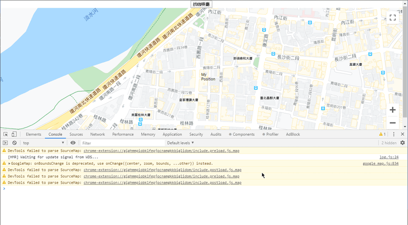
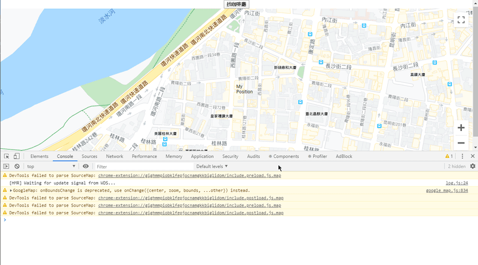
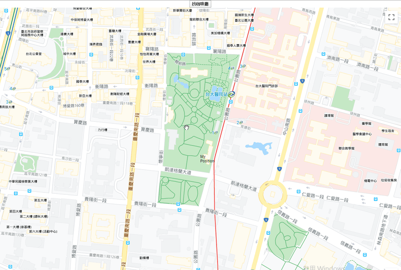

# 七天打造自己的 Google Map 應用入門 - Day03

## Day03 簡介

在 Day02 的時候，我們成功完成一個隨著移動地圖邊界就會重新更新位置的 Marker

而我們這麼做的目的，就是希望以這個 MyPosition 為基準，在更新自身位置的同時，也更新附近我們要搜尋的地標

今天的任務，就是要正式來搜尋附近的地標囉 !

## Places API

在 Day01 的介紹，如果你還有印象的話，除了 JavaScript Maps API 之外，我們還另外需要 Places API

而 Places API 的作用有很多，其中的 PlacesService API 可以供我們搜尋地標，以及各個地標的資訊等等，比如說店面的營業時間，當下是否營業，以及電話等等。

在[文件](https://developers.google.com/maps/documentation/javascript/reference/places-service)的範例中，需要使用 `google.maps.places.PLaceService` 類別 new 出一個 instance 來操作使用:

```javascript
// 這是單純使用 Vanilla JavaScript 來寫
const service = new google.maps.places.PlacesService(map);

service.nearbySearch({
  location: myLocation,
  radius: 500,
  type: ['restaurant']
}, callback);
```

但若使用 React 搭配 google-map-react，我們使用的寫法與文件上的不同，但意思很相近

在 Day02 有提到，地圖載入後的參數 `maps` 其實就是地圖 API，它指的其實就是文件中的 `google.maps`，

所以其實可以這樣寫，包在一個 Function 裡面:

```javascript
// 找咖啡廳
const findCafeLocation = () => {
  if(mapApiLoaded) {
    const service = new mapApi.places.PlacesService(mapInstance)

    const request = {
      location: myPosition,
      radius: 1000,
      type: ['cafe']
    };
  
    service.nearbySearch(request, (results, status) => {
      if(status === mapApi.places.PlacesServiceStatus.OK) {
        console.log(results)
      }
    })
  }
}
```

我們在 new 一個 `service` 時將 `mapInstance` 當作參數放入 `mapApi.places.PlacesService`，代表我們以這個地圖當作參考

而 `nearbySearch` 是 `places.PlacesService` 底下提供的一個方法，第一個參數是一個 Request，第二個參數是一個 Callback Function，在回傳 Response 後執行

關於 Request 的格式是一個 Object，裡面有幾個 key，簡單敘述一下:

|key|value|
|---|-----|
|location|搜尋時以何者為中心|
|redius|搜尋半徑，以公尺為單位|
|type|搜尋地標種類|

當然還有其他的 key，比如說 `name`，那麼就會搜尋符合該名字的地標

關於其他 key 的部分，描述 nearbySearch 中 Request 的[文件](https://developers.google.com/maps/documentation/javascript/reference/places-service#PlaceSearchRequest)這邊都有詳細的介紹，雖然我英文不好，但還是看得懂大部分，所以各位讀者可以參考看看

另外就是 Callback 中的參數，`results` 是用來放搜尋後的結果，而 status 則是搜尋狀況，如果成功搜尋，值會是 "OK"

在這個案例下，不判斷 `status` 也不會出錯，但還是建議放這條判斷，避免程式出錯

關於 `status` 的值，可以參考[這裡](https://developers.google.com/maps/documentation/javascript/reference/places-service#PlacesServiceStatus)

回歸正題，現在我們要來測試 `findCafe` 能不能有效運作，於是我安插了一個 Button 來測試:

```javascript
  <input type="button" value="找咖啡廳" onClick={findCafeLocation} />
```

來測試看看:



咦，出現了 `TypeError: Cannot read property 'PlacesService' of undefined`，意思是我們的 `mapApi` 沒有這個物件嗎? 哪裏出錯了呢?

在 `google-map-react` 套件的使用上，如果我們要啟用 API 功能，還須在 `GoogleMapReact` 這個 Component 底下的 `bootstrapURLKeys` 屬性增加 `libraries` 陣列，陣列裡面的值可以讓我們啟用欲使用的 API:

```javascript
const SimpleMap = (props) => {

// 略

  const findCafeLocation = () => {
    if(mapApiLoaded) {
      const service = new mapApi.places.PlacesService(mapInstance)

      const request = {
        location: myPosition,
        radius: 1000,
        type: ['cafe']
      };

      service.nearbySearch(request, (results, status) => {
        if(status === mapApi.places.PlacesServiceStatus.OK) {
          console.log(results)
        }
      })
    }
  }

  return (
    <div style={{ height: '100vh', width: '100%' }}>
      <input type="button" value="找咖啡廳" onClick={findCafeLocation} />
      <GoogleMapReact
        bootstrapURLKeys={{
          key: Key,
          libraries:['places'] // 要在這邊放入我們要使用的 API
        }}
        onBoundsChange={handleCenterChange}
        defaultCenter={props.center}
        defaultZoom={props.zoom}
        yesIWantToUseGoogleMapApiInternals
        onGoogleApiLoaded={({ map, maps }) => apiHasLoaded(map, maps)}
      >
        <MyPositionMarker
          lat={myPosition.lat}
          lng={myPosition.lng}
          text="My Position"
        />
      </GoogleMapReact>
    </div>
  );
}
```

加入 `libraries: ['places']` 完成後，我們再測試一次:



成功了 ! 我們的確搜尋到附近的咖啡廳了!

這邊我們大致來看一下 `results` 的結構


`results` 總共列出 20 個條目，也就是搜尋了 20 間咖啡廳，我們打開其中一個條目來看看

這邊大概講一下:

|key|value|
|---|-----|
|geometry|地標的幾何訊息，可以拿到 location|
|icon|地標的類別 Icon|
|id|地標的專屬序號，為一亂數|
|type|搜尋地標種類|
|name|名字|
|opening_hours|店面是否營業等相關資訊|
|rating|評價，目前看來是 1-5 分|
|type|此地標的種類標籤，搜尋這些 type 都會顯示此地標|
|user_ratings_total|評價總數|
|vicinity|地標的簡易地址|

當然這邊我們也可以參考文件[這裡](https://developers.google.com/maps/documentation/javascript/reference/places-service#PlaceResult)，關於 Results 都有更詳細的介紹

## 將 Results 轉換為 Marker

其實看到這邊的讀者應該就有底了，我們只要把 `results` 的內容用成 Marker，渲染在地圖上就行了

所以我們先建立一個 state 來存放搜尋到的這些地點：

```javascript
const [places, setPlaces] = useState([])
```

另外將 `findCafe` 做一點修改

```javascript
const findCafeLocation = () => {
  if(mapApiLoaded) {
    const service = new mapApi.places.PlacesService(mapInstance)

    const request = {
      location: myPosition,
      radius: 1000,
      type: ['cafe']
    };
  
    service.nearbySearch(request, (results, status) => {
      if(status === mapApi.places.PlacesServiceStatus.OK) {
        setPlaces(results) // 修改 State
      }
    })
  }
}
```

然後再將 `places` 利用 `Array.prototype.map` [方法](https://developer.mozilla.org/zh-TW/docs/Web/JavaScript/Reference/Global_Objects/Array/map)渲染在地圖上：

```javascript

// Cafe Marker
const CafeMarker = ({ icon, text }) => (
  <div>
    
    <div>{text}</div>
  </div>
)

// Map
const SimpleMap = (props) => {

  // 略

  return (
    <div style={{ height: '100vh', width: '100%' }}>
      <input type="button" value="找咖啡廳" onClick={findCafeLocation} />
      <GoogleMapReact
        bootstrapURLKeys={{
          key: Key,
          libraries:['places'] // 要在這邊放入我們要使用的 API
        }}
        onBoundsChange={handleCenterChange}
        defaultCenter={props.center}
        defaultZoom={props.zoom}
        yesIWantToUseGoogleMapApiInternals
        onGoogleApiLoaded={({ map, maps }) => apiHasLoaded(map, maps)}
      >
        <MyPositionMarker
          lat={myPosition.lat}
          lng={myPosition.lng}
          text="My Position"
        />

        // 使用 map 方法渲染
        {places.map(item=>(
          <CafeMarker
            icon={item.icon}
            key={item.id}
            lat={item.geometry.location.lat()}
            lng={item.geometry.location.lng()}
            text={item.name}
            placeId={item.place_id}
          />
        ))}
      </GoogleMapReact>
    </div>
  );
}
```

所以原理大概是：

> 點擊「找咖啡廳」-> 搜尋附近咖啡廳，並且 setPlaces -> state 更新，畫面重新 render

現在讓我們來試試看：



因為沒有特別調整 CSS，所以有點醜，不過大致上我們要的功能已經完成了 !

## 後記

今天的內容比較沒有這麼多，但實際上這一部份我卡得相當久

主要一個原因是因為沒有加入 `libraries:['places']`，不知道 bug 出在哪裏，另一方面就是文件沒有看仔細，不知道到底要怎麼在 `google-map-react` 中使用 PlacesService class (應該是我英文很爛 QQ)

而其實在 Day02 提到的 mapInstance，也是在摸索了很久之後，才明白原來最一開始於 `onGoogleApiLoaded={({ map, maps }) => apiHasLoaded(map, maps)}` 中的 `map` 指的就是地圖本身，明白之後才成功搜尋到附近的地標

最後還是謝謝大家的閱讀，傷眼抱歉！若有描述錯誤的部分也請不吝指教，感謝！
