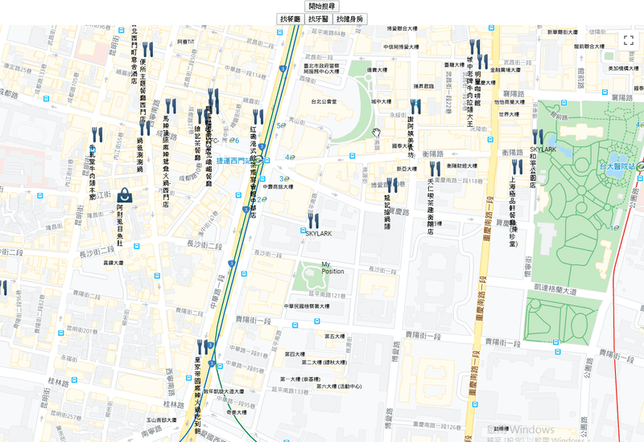
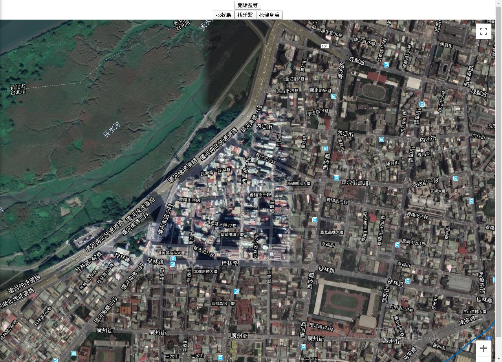
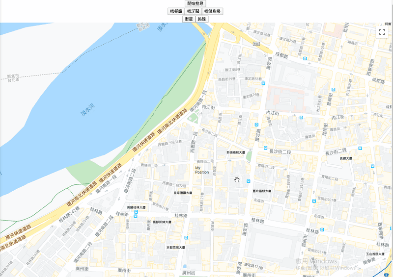

# 七天打造自己的 Google Map 應用入門 - Day04

## Day04 簡介

昨天我們已經成功搜尋到附近的咖啡廳了，今天我們就來喘口氣，先不探討新的功能，先想想我們可以怎麼做

----

## 設定搜尋類型

我們知道在使用 `nearbySearch` API 時，可以設定搜尋類型，在 Day03 的時候我們使用咖啡廳當我們的範例：

```javascript
// Day03
const findCafeLocation = () => {
  if(mapApiLoaded) {
    const service = new mapApi.places.PlacesService(mapInstance)

    const request = {
      location: myPosition,
      radius: 1000,
      type: ['cafe'] // 咖啡廳
    };
  
    service.nearbySearch(request, (results, status) => {
      if(status === mapApi.places.PlacesServiceStatus.OK) {
        setPlaces(results)
      }
    })
  }
}
```

那我們還能搜尋哪幾種類型的地標呢？

一樣搜尋 [Google Maps API 文件](https://developers.google.com/places/supported_types)，可以看到可以搜尋的類型多達下面好幾種：

```n
accounting
airport
amusement_park
aquarium
art_gallery
atm
bakery
bank
bar
beauty_salon
bicycle_store
book_store
bowling_alley
bus_station
cafe
campground
car_dealer
car_rental
car_repair
car_wash
casino
cemetery
church
city_hall
clothing_store
convenience_store
courthouse
dentist
department_store
doctor
drugstore
electrician
electronics_store
embassy
fire_station
florist
funeral_home
furniture_store
gas_station
grocery_or_supermarket
gym
hair_care
hardware_store
hindu_temple
home_goods_store
hospital
insurance_agency
jewelry_store
laundry
lawyer
library
light_rail_station
liquor_store
local_government_office
locksmith
lodging
meal_delivery
meal_takeaway
mosque
movie_rental
movie_theater
moving_company
museum
night_club
painter
park
parking
pet_store
pharmacy
physiotherapist
plumber
police
post_office
primary_school
real_estate_agency
restaurant
roofing_contractor
rv_park
school
secondary_school
shoe_store
shopping_mall
spa
stadium
storage
store
subway_station
supermarket
synagogue
taxi_stand
tourist_attraction
train_station
transit_station
travel_agency
university
veterinary_care
zoo

```

這就代表我們可以做一些按鈕或者表單，用來更新我們的搜尋類型：

```javascript
// 上略

// 創建一個 state
const [searchingType, setSearchType] = useState('cafe')

// 搜尋
const findLocation = () => {
  if(mapApiLoaded) {
    const service = new mapApi.places.PlacesService(mapInstance)

    const request = {
      location: myPosition,
      radius: 4000,
      type: searchingType // 改為 state
    };
  
    service.nearbySearch(request, (results, status) => {
      if(status === mapApi.places.PlacesServiceStatus.OK) {
        setPlaces(results)
      }
    })
  }
}

// 做一個 Function 可以改變搜尋類型
const handleSearchType = e => {
  setSearchType(e.target.name)
}

// render
return (
  <div style={{ height: '100vh', width: '100%' }}>
    <input type="button" value="開始搜尋" onClick={findLocation} />
    <input type="button" value="找餐廳" onClick={handleSearchType} name="restaurant"/>
    <input type="button" value="找牙醫" onClick={handleSearchType} name="dentist"/>
    <input type="button" value="找咖啡廳" onClick={handleSearchType} name="cafe"/>
    <GoogleMapReact
      bootstrapURLKeys={{
        key: Key,
        libraries:['places']
      }}
      options={{ mapTypeId: mapType }}
      onBoundsChange={handleCenterChange}
      defaultCenter={props.center}
      defaultZoom={props.zoom}
      yesIWantToUseGoogleMapApiInternals
      onGoogleApiLoaded={({ map, maps }) => apiHasLoaded(map, maps)}
    >
```

用這樣的作法，我們就可以改變搜尋類型了

`input` 這邊應該是要包成 Component 比較美觀，所以我們可以簡單包一下：

```javascript
// 切換搜尋類型按鈕
const SearchType = ({ text, type }) => {
  return <input type="button" value={text} name={type} />
}

const SimplaMap = () => {
  //　略

  //render
  return (
    <div style={{ height: '100vh', width: '100%' }}>
      <input type="button" value="開始搜尋" onClick={ findLocation } />
      <div onClick={ handleSearchType }>
        <SearchType text="找餐廳"　type="restaurant" />
        <SearchType text="找牙醫"　type="dentist" />
        <SearchType text="找健身房"　type="gym" />
      </div>
      <GoogleMapReact
      bootstrapURLKeys={{
        key: Key,
        libraries: ['places']
      }}
      ...
```



這樣就沒問題了，接下來我們看看還有什麼 API 可以用

----

## 地圖種類

現在我們可以製作一個挺酷的功能，那就是切換路面圖與衛星圖

實作方法也相當簡單，我們可以在 `<GoogleMapReact>` 加入一個屬性，叫做 `option`，並在內中放一個物件，給一個 key 為 `mapTypeId`，試試看值 `hybrid`

```javascript
<GoogleMapReact
  bootstrapURLKeys={{
    key: Key,
    libraries:['places']
  }}
  options={{ mapTypeId: 'hybrid' }}
  onBoundsChange={handleCenterChange}
  defaultCenter={props.center}
  defaultZoom={props.zoom}
  yesIWantToUseGoogleMapApiInternals
  onGoogleApiLoaded={({ map, maps }) => apiHasLoaded(map, maps)}
>
```

可以看到變成衛星圖了！



這也代表我們可以做一組切換按鍵，來切換衛星圖與路線圖：

```javascript
// 上略

// 創建一個 state
const [mapType, setMapType] = useState('roadmap')

// 改變地圖樣式
const handleMapTypeId = e => {
  setMapType(e.target.name)
}

const SimplaMap = () => {
  //　略..

  //render
  return (
    <div style={{ height: '100vh', width: '100%' }}>
      <input type="button" value="開始搜尋" onClick={ findLocation } />
      <div onClick={ handleSearchType }>
        <SearchType text="找餐廳"　type="restaurant" />
        <SearchType text="找牙醫"　type="dentist" />
        <SearchType text="找健身房"　type="gym" />
        <input type="button" value="衛星" onClick={ handleMapTypeId } name="hybrid" />
        <input type="button" value="路線" onClick={ handleMapTypeId } name="roadmap" />
      </div>
      <GoogleMapReact
      bootstrapURLKeys={{
        key: Key,
        libraries:['places']
      }}
      ...
```

一樣，我們可以把它包得美觀一點，但這邊就不另行製作了，我們留到下次再優化

順帶一提，如果我們沒有放入 `option`，它的預設 mapTypeId 就會是 `roadmap`

來看看會如何切換吧！



----

另外關於 Map Types，這邊列出四種，包括我們已知的兩種：

|Map Type||
|---|---|
|roadmap|路線圖，也是默認類型|
|satellite|即 Google Earth 的衛星圖像|
|hybrid|普通視圖與衛星圖像的混合|
|tettain|地形物理地圖|

----

## 後記

今天的內容不多，主要是在思考這個系列的成品要做成什麼樣子

原本打算只做簡單一點就好，但後來覺得好像太簡單了

我覺得主要的問題在於最初花了很多時間在看文件，才會有那種我花好多時間做了地圖應用的假象

預計明天的內容是關於更便利的搜尋功能與解決一些 setState 的非同步問題
