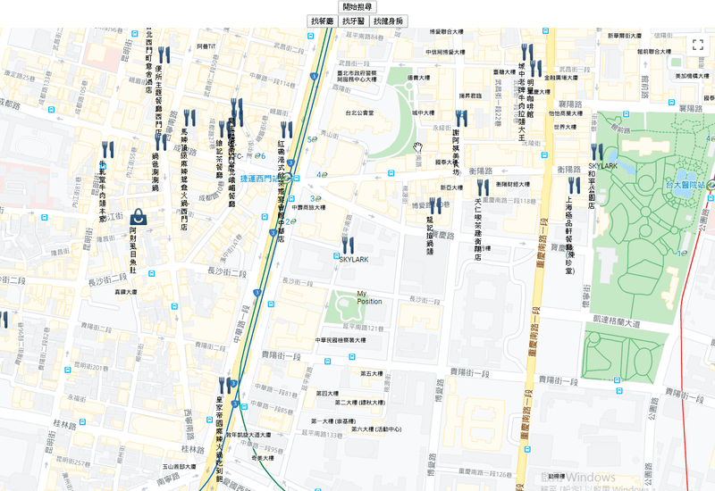
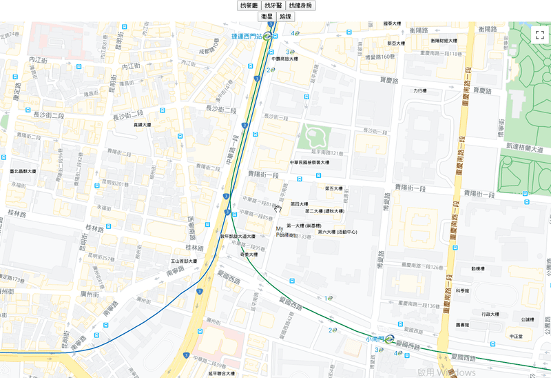

# 七天打造自己的 Google Map 應用入門 - Day05

## Day05 簡介

在 Day04 的時候我們做出了搜尋不同類型的地標，以及路線圖與衛星地圖樣式的切換，今天我們就要再優化一下我們的小程式，以及解釋一下初學者可能會遇到的非同步問題

-----

## 切換搜尋類型時直接搜尋

原本我們都要按「開始搜尋」的按鈕才會執行 `findLocation` 這個函式，現在我希望只要我點選「找餐廳」或者「找牙醫」之類的按鈕，就會幫我自動搜尋，不用額外按開始搜尋，

原本的狀況是這樣，需要按下開始搜尋才會更新 `places` 這個 state，然後重新渲染地圖上的 Marker :



現在我們想改成，按完改變搜尋類型的按鈕之後就直接「開始搜尋」

從最直覺的想法來看，我們可能會把 `findLoacation` 放在「改變搜尋類型」的 Function 裡面，讓它接著執行就好:

```javascript
// 搜尋
const findLocation = () => {
  if(mapApiLoaded) {
    const service = new mapApi.places.PlacesService(mapInstance)
    const request = {
      location: myPosition,
      radius: 1000,
      type: searchType
    };

    service.nearbySearch(request, (results, status) => {
      if(status === mapApi.places.PlacesServiceStatus.OK) {
        setPlaces(results)
      }
    })
  }
}

//　改變搜尋類型
const handleSearchType = e => {
  setSearchType(e.target.name)
  findLocation() // 直接執行搜尋，改變 places
}
```

讓我們試試看:



感覺好像成功了，但好像哪裏怪怪的?

發現問題了嗎? 第一次在點選「找牙醫」的時候，程式找的是咖啡廳，第二次點選「找健身房」時候，程式找的是牙醫

這邊就要稍微提一下 React 中關於 `setState` 的非同步機制

以 `setSearchType(e.target.name)` 來說，本身會進行非同步操作

所以實際上，在 `handleSearchType` 中，是先執行 `findLocation`，才執行 `setSearchType` 改變 `searchType`

```javascript
//　改變搜尋類型
const handleSearchType = e => {
  setSearchType(e.target.name) // 2. 再執行
  findLocation() // 1. 先執行
}
```

當我們第一次點「找牙醫」後，`findLocation` 先執行，此時的 `searchType` 仍是我們預設的 `'cafe'`，所以當 Response 回來執行的 `setPlaces` 也會是後台搜尋咖啡廳後返回的資料

而 `findLocation` 中同步的部分執行後，`setSearchType(e.target.name)` 才會執行，此時的 `searchType` 才會被更新為 `dentist`

第二次點選「找健身房」時，也是同樣的道理，`searchType` 是上一次更新後的 `dentist`，所以才會 render 出牙醫診所的地標，而不是健身房

那要怎麼解決呢?

通常在更改 `state` 之後要馬上執行某個 Function，若是 Classic Component 的寫法，你可能會想到將這個 Function 放在 `setState` 第二個參數:

```javascript
this.setState({
  searchType: e.target.name
}, findLocation)
```

又或者你想到的是 `componentDidUpdate()`，但這邊又考慮到 `this.state.places` 的更新(Classic 寫法)，可能會造成無限執行的 Loop

在 React Hook 的寫法中，你可以想到的一個 hook 是 `useEffect`，它可以做出類似 Classic Components 中生命週期的效果，我們可以這樣寫:

```javascript
useEffect(() => {
    findLocation()
  },[searchType])
```

在 `useEffect()` 中的第二個參數，看起來是一個 Array，`useEffect` 會比對重新 render 時 Array 中的值，若不一樣，則執行函式，也就是我們要的 effect(副作用)

相反的，若重新 render 時，searchType 的值若沒有改變，React 會忽略這個 effect

我們可以測試一下:

```javascript
//　改變搜尋類型
const handleSearchType = e => {
  setSearchType(e.target.name)
}

// 搜尋
const findLocation = () => {
  if(mapApiLoaded) {
    alert('搜尋類型改變了!') // 用來看有沒有執行 effect
    const service = new mapApi.places.PlacesService(mapInstance)

    const request = {
      location: myPosition,
      radius: 1000,
      type: searchType
    };

    service.nearbySearch(request, (results, status) => {
      if(status === mapApi.places.PlacesServiceStatus.OK) {
        setPlaces(results)
      }
    })
}

// Effect
useEffect(() => {
  findLocation()
},[searchType])
```


點擊第一次「找牙醫」有成功 render，之後同樣點擊找牙醫則沒有 alert，所以這個方法的確達成了我們要的目的:


-----

## 程式一開啟就搜尋

如果更懶一點，或許你可以考慮程式一直處在搜尋狀態，也就是當我移動一次位置，就直接搜尋一次

這樣的話，或許還可以將「找餐廳」，「找牙醫」等等的按鍵改成 Checkbox，當作我們當下要搜尋什麼類型就好

依照剛剛 Effect 的用法，既然只要比對 state 的不同，就會執行 effect，那要做到移動位置就搜尋，應該在 `useEffect` 第二個參數的 Array 中將 myPostion 也納入比對就好:

```javascript
// 最早的時候創建的 state
const [myPosition, setMyPosition] = useState({
  lat: 25.04,
  lng: 121.50
})

// 最早的時候創建的 Function: 處理中心點改變
const handleCenterChange = () => {
  if(mapApiLoaded) {
    setMyPosition({
      lat: mapInstance.center.lat(),
      lng: mapInstance.center.lng()
    })
  }
}

// Effect
useEffect(() => {
  findLocation()
},[searchType, myPosition])
```

`handleCenterChange` 會被綁在 `GoogleMapReact` 這個 Component 中的 `onBoundsChange` 事件中，不清楚的朋友可以回 Day02 參考

看起來好像沒問題了，移動之後，由於 `myPosition` 改變，所以會執行 `findLocation`


基本上做到這邊就 OK 了，但是如果我們還想要做出「一進到程式就執行搜尋的功能」，光是比對 `myPosition` 還不夠，因為程式一開始載入時，`myPosition` 的初始值也設定了，程式載入之後不移動，`myPosition` 沒有變，就不會有 effect

```javascript
onst [myPosition, setMyPosition] = useState({
  lat: 25.04,
  lng: 121.50
})
```

但其實我們在最初時也有設一個 state，那就是 `mapApiLoaded`，這個 state，是我們做的一個開關，用來確定在 `GoogleMapReact` 中，Google Map API 已載入完成

將 `mapApiLoaded` 加入 useEffect 中的比對項目，就可以達到我們要的效果，但實不實用就見仁見智了

```javascript
// Effect
useEffect(() => {
  findLocation()
},[mapApiLoaded, searchType, myPosition])
```

看看效果:


大概就是這樣囉 !

-----

## 後記

今天探討的比較多是關於 `setState` 中的非同步處理，這邊也是初學者稍不注意就會卡很久的地方

記得以前在學習時也碰到類似的坑，之後的解法則是將其放入生命週期之中解決

而就 `useEffect` 思考模式而言，又與生命週期的概念不太相同，這邊各位可以參考這篇由 Dan 大撰寫的 [useEffect 完整指南](https://overreacted.io/zh-hans/a-complete-guide-to-useeffect/)

連結是簡體中文，你也可以切換成繁體或原文的版本，相對於繁體，我覺得簡體翻譯得比較好懂

順帶一提，這篇文同時也是近期我參與過的讀書會探討主題，當時參加覺得獲益良多，所以相當推薦

而讀書會的主辦者 KK 大本人也有參加這屆的開發者寫作松，各位可以多多關注

大概就是這樣，後面兩天也還在思考要寫什麼，應該會研究一下自動完成

但如果研究不完，就會專注在優化程式功能的部分

謝謝大家的收看，上述程式碼可能有瑕疵或寫得不好的部分，請各位多多包涵並不吝給予批評指教 QQ
