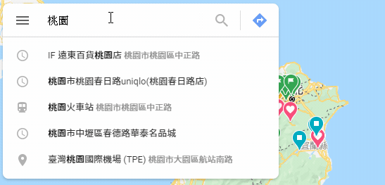
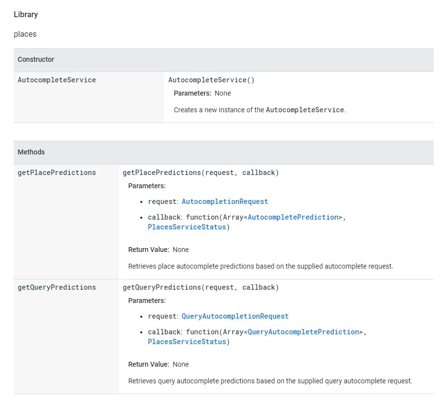
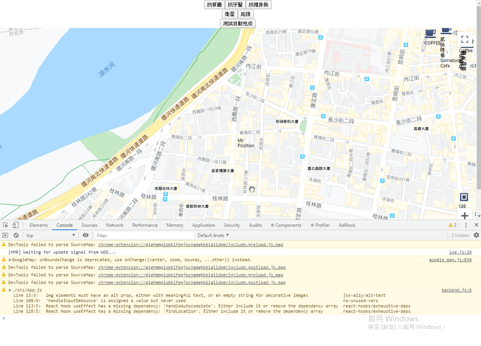
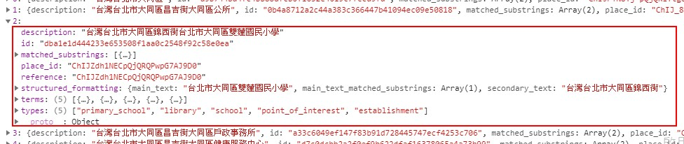
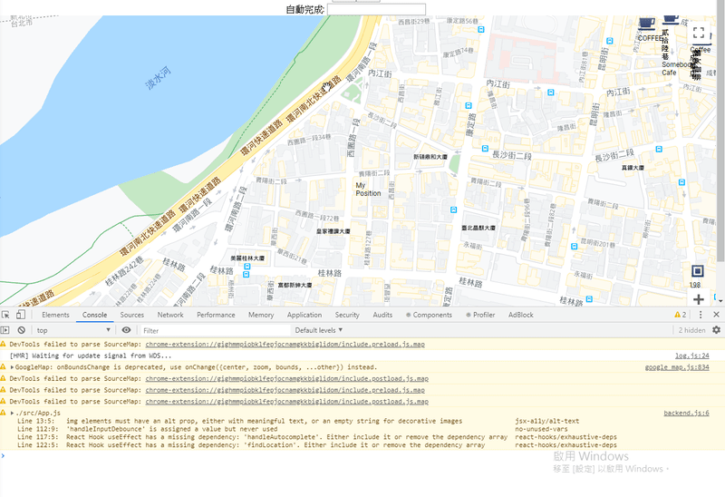
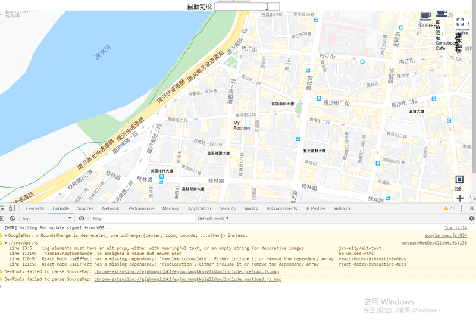
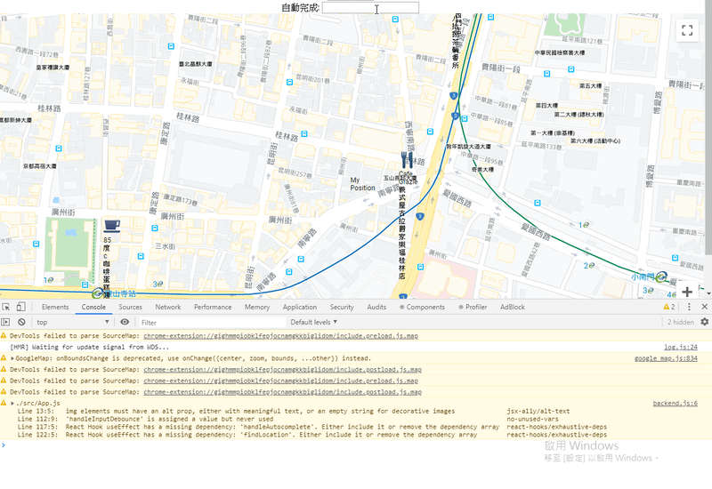
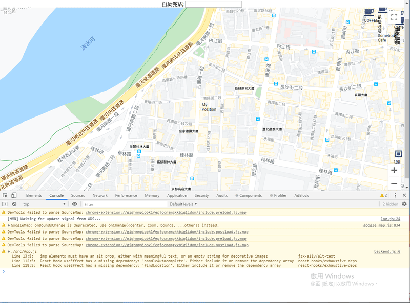

# 七天打造自己的 Google Map 應用入門 - Day06

## Day06 簡介

Day05 時我們已經優化了我們的搜尋附近地標小程式，也解決了一些非同步問題，讓我們不用按「開始搜尋」也可以自動找到附近的地標。

今天我們來研究一下 Google Map API 中另一個很常被討論的 API，自動完成 (Autocompelete) 吧 !

-----

## Autocompelete API

要理解自動完成，要先知道它能呈現怎樣的功能，基本上就是當我們在搜索框內輸入地址時，就會自動彈出相近的地址供我們點選，大家應該都很熟悉 :



其實要了解 Autocompelete 並不難，關於 Autocompelete 的[官方文件](https://developers.google.com/maps/documentation/javascript/reference/places-autocomplete-service?hl=zh-TW) 給了很明確的答案:



各位可以回想在 Day03 的時候，我們使用 `nearbySearch` 來搜尋附近的地標，`nearbySearch` 有兩個參數，第一個 `request` 是一個 Object，第二個參數是一個 Callback，當後台返回資料時，執行這個 Callback，這我們在 Day03 已經有提過。

Autocompelete 也是一樣的道理，`AutocompleteService` 底下的 `getPlacePredictions` 方法與上述的 `nearbySearch` 很相似，第一個參數 `request` 是一個 Object，這個 Object 中有我們需要的搜尋條件，而第二個參數同樣是一個 Callback，當後台返回資料時，執行這個 Callback，而返回的資料就是「建議的搜尋」，也就是我們輸入地址時，建議的地址內容。

順帶一提，`AutocompleteService` 底下除了 `getPlacePredictions` 方法以外，還有 `getQueryPredictions` 方法，我有查詢過兩者的差異，前者似乎是以地標為搜索基準，後者則是以輸入內容為搜索基準，但我這樣說應該也不完全正確。

但在今天的例子中，我不論使用哪一種方法，都是回傳一樣的結果，所以這邊就先不探究兩者的差異，希望有經驗的大大可以在下方補充，十分感謝!

好，既然我們已經大致掌握了 `getPlacePredictions` 的使用方法，那就來寫 code 測試看看:

```javascript
// 自動完成
const handleAutocomplete = () => {
  if(mapApiLoaded) {
    const service = new mapApi.places.AutocompleteService()
    const request = {
      input: '台北市大同區'
    }

    service.getPlacePredictions(request, results => {
      console.log(results)
    });
  }
}
```

關於 request，我們有幾個條件可以使用，不過以今天的範例而言，我只會使用到 `input` 它負責接收字串，也就是實務上我們所輸入的地址 (其他條件請參考文件)

我先將 `input` 設為 `'台北市大同區'`，看看會得到哪些資料，先做一個按紐來啟動 `handleAutocomplete`

```html
<input type="button" value="測試自動完成" onClick={handleAutocomplete} />
```



可以看到 log 出的資料的確符合「台北市大同區」的相關描述，是一個長度為 5 的 Array，現在我們打開其中一項來看看 :



簡單看到 `description` 與 `structured_formatting` 的部分，顯示的分別是地名與地址等資訊，這應該就是我們最需要用到的資料

而另外一個值得注意的是 `place_id`，你有注意到我們返回的資料沒有經緯度嗎? 在之後如果我們需要直接跳到地標，就會需要 `place_id` 當作另一個方法中 request 的其中一個屬性，以取得這個地名的經緯度，以建立標記

其餘的部分各位一樣可以參考文件，都有詳細的敘述，這邊就不贅述了

-----

## 結合 Input 輸入框

既然自動完成的 Function 已經可以運行，那我們只要將 request 中 `input` 的 value 值與我們輸入框的 value 做綁定，就可以大致完成我們要的功能了

這邊我們會使用到 `useRef`，這個 hook 的概念並不難，它可以讓我們快速的訪問到 DOM 節點，首先我們先建立一個 Ref:

```javascript
// 建立參考點
let inputRef = useRef(null);
```

然後建立一個輸入框，使它的 `ref` 屬性為剛剛的參考點

```jsx
// render
自動完成: <input ref={inputRef} type="text" onChange={showInputValue} />
```

`showInputValue` 是一個簡單的 Function，我們 log 出 `inputRef.current.value` 看看 :

```javascript
const showInputValue = () => console.log(inputRef.current.value)
```



可以看到每當我在輸入框輸入值，觸發 `onChange`，`inputRef.current.value` 都會隨之變動，Ref 是一個參考，所以其實你可以將之視為 `<input>` 本身

確定綁定之後，我們就可以將 `showInputValue` 改寫為以下 Function，我們也建立相對應所需的 state :

```javascript
// 建立 state
const [inputText, setInputText] = useState('')

// 更改 state
const handleInput = () => {
  setInputText(inputRef.current.value)
}
```

```jsx
// render
自動完成: <input ref={inputRef} type="text" onChange={handleInput} />
```

我們也一股作氣，將先前執行自動完成的 `handleAutocomplete` 做為 effect，當 `useEffect` 察覺 inputText 有變動時，就執行 `handleAutocomplete`

```jsx
// 自動完成
const handleAutocomplete = () => {
  if(mapApiLoaded) {
    const service = new mapApi.places.AutocompleteService()
    const request = {
      input: inputText // input 為 inputText
    }

    service.getPlacePredictions(request, results => {
      console.log(results)
    });
  }
}

// 當 inputText 改變時，執行自動完成
useEffect(()=>{
  handleAutocomplete()
},[inputText])
```

現在讓我們來試試看:



的確有回傳資料，但眼尖的你有沒有發現兩個問題?

第一個問題是我每按一個按鍵就會觸發 `setInputText` 改變 `inputText`，當 `inputText` 改變時又會觸發 effect，也就是執行自動完成 `handleAutocomplete`

但通常我會希望輸入一個完整的地址時，才執行自動完成，而不是當我輸入到一半如 `'台北市大ㄊ'` 時，幫我執行自動完成

第二個問題是回傳的資料有空值，也就是 `null`，為什麼會是 `null` 呢?

先回答第二個問題，記得在 Day3 的時候，關於 `nearbySearch` 參數中的 Callback ，有一個我們需要判斷的 `status`

```jsx
// Day03 的搜尋
const findLocation = () => {
  if(mapApiLoaded) {
    const service = new mapApi.places.PlacesService(mapInstance)
    const request = {
      location: myPosition,
      radius: 1000,
      type: searchType
    };
  
    service.nearbySearch(request, (results, status) => {
      if(status === mapApi.places.PlacesServiceStatus.OK) { // 比對 status 為 OK
        setPlaces(results)
      }
    })
  }
}
```

在相似的自動完成 `handleAutocomplete` 中，我故意沒有加入這個 `status`，也就是我不去判斷 `status` 是否為 `OK`:

```jsx
// 自動完成
const handleAutocomplete = () => {
  if(mapApiLoaded) {
    const service = new mapApi.places.AutocompleteService()
    const request = {
      input: inputText // input 為 inputText
    }

    service.getPlacePredictions(request, results => { // 不考慮 status 的使用
      console.log(results) // 剛剛的 result 為 null
    });
  }
}
```

而之所以回傳的資料為空，就是因為 `status` 出了問題，現在讓我們加入 `status` 並印出，然後模擬剛剛的狀況就知道了:

```jsx
// 讓我們改寫一下
  const handleAutocomplete = () => {
    // 略
  
      service.getPlacePredictions(request, (results, status)=> {
        console.log("Status:" + status) // 印出 status
        console.log(results)
      });
    }
  }
```



可以看到 Status 顯示的是 `ZERO_RESULTS`，其實除了 `OK` 與 `ZERO_RESULTS`，也包括了短時間請求次數過多的 `OVER_QUERY_LIMIT` 等等

如果不在這邊做 status 的判斷，很容易造成資料因為空值而出錯，所以我們可以在這邊就先利用 `status` 來做判斷，避免可能的意外

其他的 `status` 可以參考[這裡](https://developers.google.com/maps/documentation/javascript/reference/places-service#PlacesServiceStatus)，這邊就不多贅述，所以最後我們將 `handleAutocomplete` 改寫如下 :

```jsx
// 自動完成
const handleAutocomplete = () => {
  if(mapApiLoaded) {
    const service = new mapApi.places.AutocompleteService()
    const request = {
      input: inputText
    }

    service.getPlacePredictions(request, (results, status)=> {
      if(status === mapApi.places.PlacesServiceStatus.OK) {
        console.log(results)
      }
    });
  }
}
```

好，第二個問題解決了，我們現在來回頭解決第一個問題:

-----

## 使用 Debounce 來解決

簡單講述一下 Debounce 的概念，我習慣這樣解釋 Debounce 的功用 :

「當觸發一個事件之後，若一定時間內不再觸發，才會**執行**因觸發事件而該執行的函式」

在輸入框 `<input>` 的案例中，觸發的事件是 `onChange`，也就是當我每按下一個按鍵，都會觸發一次 `onChange`

而「因觸發事件而該執行的函式」則是 `handleInput`，也是因為這個函式執行後，修改了 `inputText` ，進而接著執行自動完成

我們不希望每按一次按鍵，就執行一次自動完成，我們希望的是輸入完一段大致完整的地址後，才執行自動完成

所以套用 Debounce 的概念，就是當我一定時間沒有輸入新的字，更甚者，也就是一定時間不按按鍵之後，才幫我執行自動完成，如此的話，發送的 request 中的 `input` 才會是一個大致完整的地址

而這段固定的時間，可能會是 0.5 秒左右，畢竟現代的人打字都很快，我們不需要把等待時間設定得太長，0.5 秒就可以判斷出使用者已經停止打字了

要使用 Debounce，你可能已經聽過 Lodash 了，但我們今天不會解釋太多 Lodash 和 Debounce 相關的使用和語法，我們直接來實做:

```jsx
import { debounce } from 'lodash'

// 略

// render
<div>
  自動完成: <input ref={inputRef} type="text" onChange={ debounce(handleInput, 500) } />
</div>
```

來看看結果 :



成功了，輸入幾個字，不再輸入之後，成功拿到資料了 !

當然若要使用節流 (Throttle) 的話也是可以，但這邊就不多探討了

-----

## 後記

上述的範例中，有一點須特別注意:

由於上述我的 `<input>` 是 Uncontrolled Component，所以使用 `debounce` 處理 `handleInput` 時不會有副作用

相反的，若是 Controlled Component，也就是如下寫法

```jsx
自動完成: <input type="text" value={this.state.inputText} />`
```

由於 `<input>` 的 `value` 是綁 `this.state`，所以如果使用 Debounce 延遲 0.5 秒後才執行 `setState`，就會發生你打字後 0.5 秒，對話框才會出現字的窘境，這也是我第一次使用 Debounce 時犯的錯誤

今天我們已經成功拿到自動完成返回的資料了，明天，也是最後一天，我們將會完成自動完成後半的部分

謝謝 !
