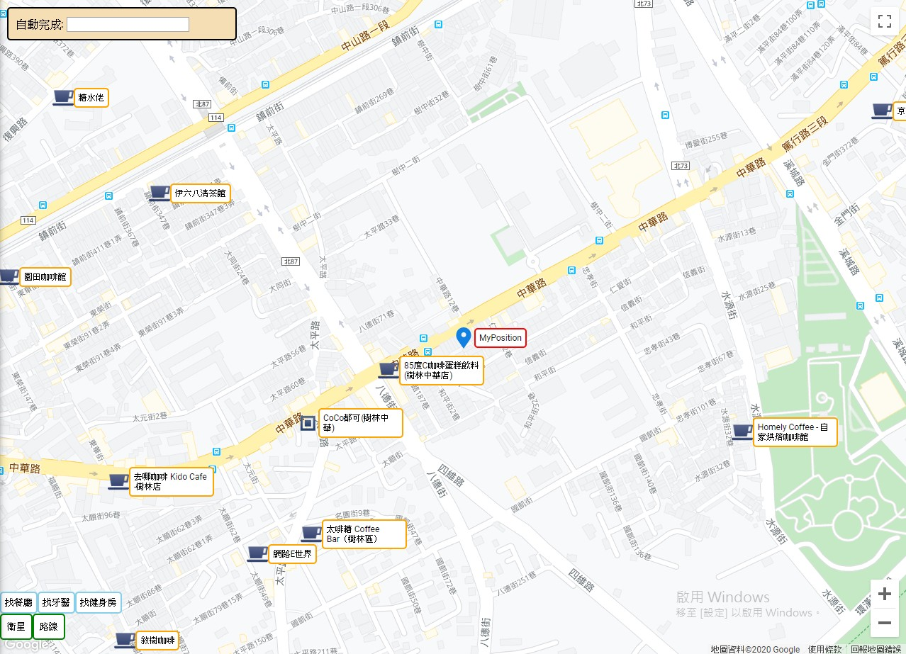
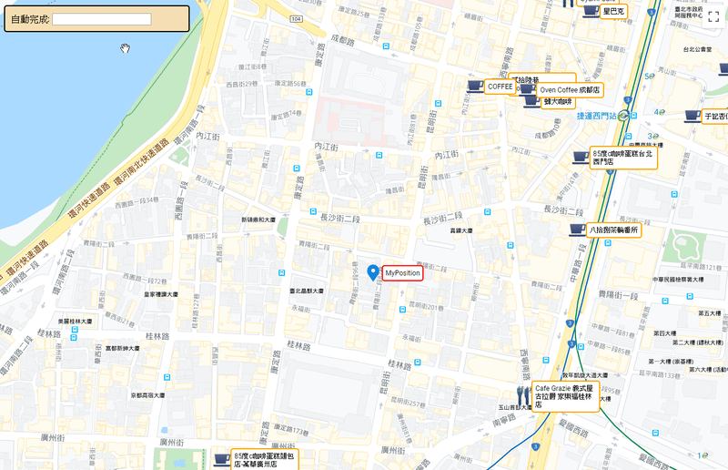
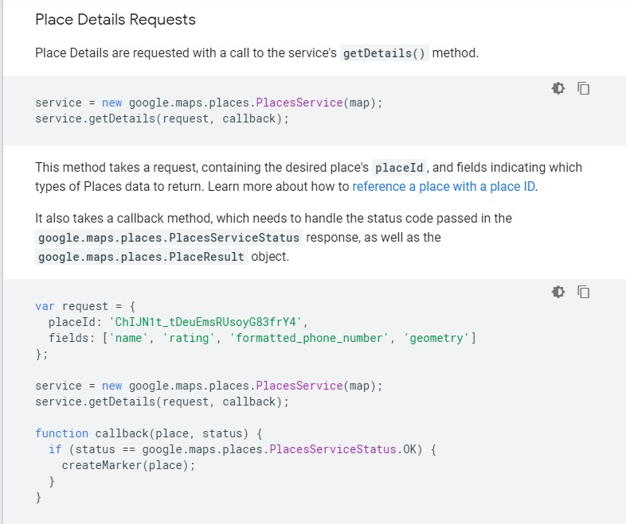
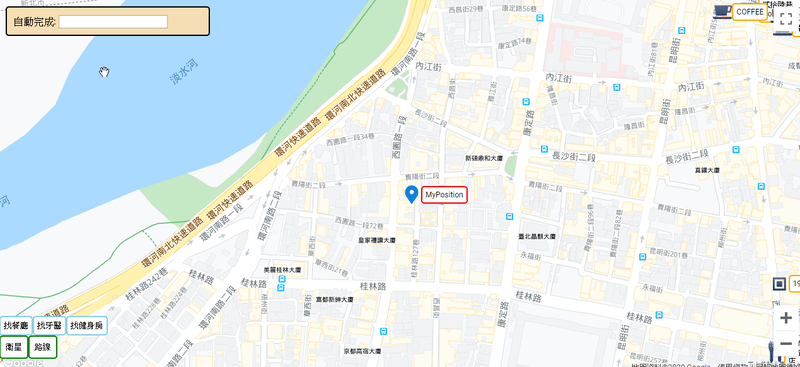
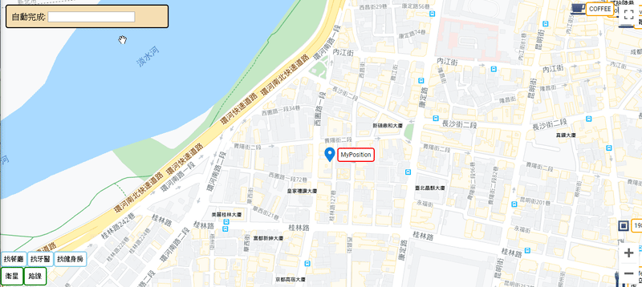
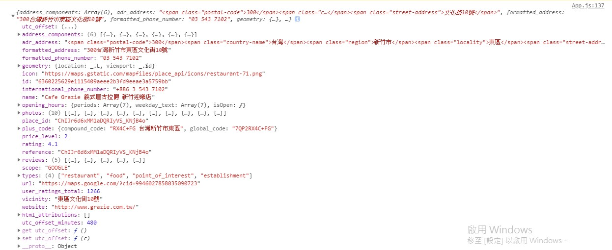
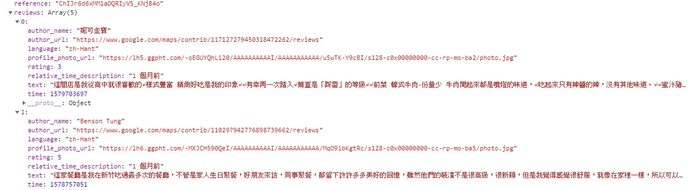
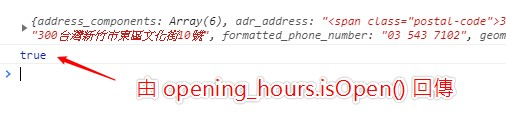
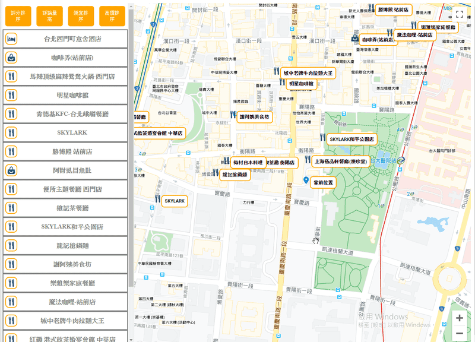

# 七天打造自己的 Google Map 應用入門 - Day07

## Day07 簡介

昨天我們完成了自動完成的前段部分，今天要完成剩下的部分，也就是將後台返回的建議地址供我們使用，另外也會介紹一下 `getDetails` 這個 API

因為是最後一天，所以我將 UI 弄得比較美觀一點，這是我們現下的地圖:



-----

## 繼續處理使用 getPlacePredictions 回傳的資料

昨天我們寫了這樣的 Funtion，讓我們可以印出自動完成返回的地址清單：

```jsx
// 自動完成
const handleAutocomplete = () => {
  if(mapApiLoaded) {
    const service = new mapApi.places.AutocompleteService()
    const request = {
      input: inputText
    }

    service.getPlacePredictions(request, (results, status)=> {
      if(status === mapApi.places.PlacesServiceStatus.OK) {
        console.log(results)
      }
    });
  }
}
```

剩下的部分並不難，我們將 results 寫入我們的 state：

```jsx
const [autocompleteResults, setAutocompleteResults] = useState([])
```

```jsx
// 自動完成
const handleAutocomplete = () => {
  if(mapApiLoaded) {
    const service = new mapApi.places.AutocompleteService()
    const request = {
      input: inputText
    }

    service.getPlacePredictions(request, (results, status)=> {
      if(status === mapApi.places.PlacesServiceStatus.OK) {
        //console.log(results)
        setAutocompleteResults(results) // 寫入 state 供我們使用
      }
    });
  }
}

// 當 inputText 改變時，執行自動完成
useEffect(()=>{
  handleAutocomplete()
},[inputText])


// render
// ...
<div>
  <div >
  自動完成: <input ref={inputRef} type="text" onChange={ debounce(handleInput, 500) } />
  </div>
  <div>
    {(autocompleteResults && inputText) ?
    autocompleteResults.map(item=>(
      <div key={item.id} dataid={item.place_id}>　
        {item.description}
      </div>
    )) : null}
  </div>
</div>
// ...
```

使用三元運算子與 `Array.prototype.map` 方法渲染清單，其中 `key` 的部分我們採用 results 給我們的 id，而 `dataid` 則是取用 `place_id`，這兩個都不會顯示在自動搜尋的清單上

`key` 值是必定要帶上去的，如果不帶上去會跳出警告，其目的是供 React 底層能正確比對 DOM 元素

`dataid` 是自訂義屬性，所以等等我們需要使用 `e.target.getAttribute('dataid')` 來取值

其實這邊可以直接寫成別的屬性，就不一定要用 `getAttribute()`，所以這邊大家看看就好

順帶一提，由於 CSS 的部分不是這次系列文探討的重點，所以上述程式碼我就直接省略了 CSS 的部分

我們來看一下效果：



接下來，我們要做的是，當點擊清單上的地址，就可以瞬間讓地圖視角轉移過去

所以思路就是:

> 點擊清單上的地址 => 取得該地址的經緯度 => 改變我們的地圖視角為該經緯度 => 改變 myPositionMarker 為該經緯度

於是我們寫一個 Function 供 onClick 事件使用:

```jsx
// 點擊自動完成地址時，更改 MyPosition
const handleClickToChangeMyPosition = e => {
  const placeId = e.target.getAttribute('dataid')
  console.log(placeId)
}
```

然後也在外層標籤放上 onClick 屬性與監聽事件:

```jsx
// render
// ...
<div>
  <div >
  自動完成: <input ref={inputRef} type="text" onChange={ debounce(handleInput, 500) } />
  </div>
  <div onClick={handleClickToChangeMyPosition}> // 加入 onClick
    {(autocompleteResults && inputText) ?
    autocompleteResults.map(item=>(
      <div key={item.id} dataid={item.place_id}>
        {item.description}
      </div>
    )) : null}
  </div>
</div>
// ...
```


的確拿到 `place_id` 了，現在我們用它來做一點事情

-----

## getDetails

在 Google Map API 有一個 API 可以藉由發出 `place_id` 以取得該地名 / 地標的相關資訊，包括經緯度，店名，甚至是電話等等，這個 API 就是 `getDetails`，我們來看看官方文件的介紹 :



使用方法與先前的 `nearchSearch` 與 `getPlacePredictions` 差不多，需要特別提到的是 `fields` 這個 Array，這邊會帶上你所需要的搜尋條件，在上圖的範例中，就包含有名字(name)、評價(rating)等等

大概看懂 `getDetails` 之後，我們這邊就直接來繼續建構 `handleClickToChangeMyPosition` :

```jsx
// 建立 state，供地圖本身做參考，以改變地圖視角
const [currentCenter, setCurrentCenter] = useState({})

// 點擊自動完成地址時，更改 MyPosition
const handleClickToChangeMyPosition = e => {
  const placeId = e.target.getAttribute('dataid')

  const service = new mapApi.places.PlacesService(mapInstance)
  const request = {
    placeId,
    fields: [
      'geometry'
    ]
  }

  service.getDetails(request, (results, status)=>{
    if( status === mapApi.places.PlacesServiceStatus.OK) {
      const newPosition = {
        lat: results.geometry.location.lat(),
        lng: results.geometry.location.lng()
      }
      setCurrentCenter(newPosition) // 改變地圖視角位置
      setMyPosition(newPosition) // 改變 MyPosition
      setAutocompleteResults([]) // 清空自動搜尋地址清單
      inputRef.current.value = '' // 清空 <input>
    }
  })
}

```

這邊要特別提一下，我們建立了 `currentCenter` 來供地圖視角參考，否則當我們點擊地址，改變了 `MyPosition` 的位置，但當下的地圖視角還是在原來的位置，像是這樣:



可以看到 MyPosition 飛走了，但地圖視角還是在同樣的位置

那如何讓地圖去參考 `currentCenter` 呢 ?

在 `GoogleMapReact` 這個 Component 中，有一個 props 可以供我們傳入當下的經緯度，這個 props 就是 `center` :

```jsx
//render
// ...
<GoogleMapReact
  bootstrapURLKeys={{
    key: Key,
    libraries:['places']
  }}
  center={currentCenter} // 傳入 currentCenter
  options={{ mapTypeId: mapType }}
  onBoundsChange={handleCenterChange}
  defaultCenter={props.center}
  defaultZoom={props.zoom}
  yesIWantToUseGoogleMapApiInternals
  onGoogleApiLoaded={({ map, maps }) => apiHasLoaded(map, maps)}
>
...

```

`center` 接收一個 Object 中的 `lat` 與 `lng` 屬性，並使地圖正中心對準其經緯度，所以在概念上，我們就可以藉由更改 `currentCenter`，來改變地圖視角

現在讓我們重新試試看:



如此，我們就完成了關於自動完成的基本功能了 !

-----

## 使用 getDetails API 實做更多的功能

接下來大概講述一下我們還能用 getDetails API 實現的功能，但由於概念上都差不多，所以這邊不會手把手實做

前面有提到在執行 `getDetails` 的 request 中，有許多我們可以放入的搜尋條件

現在我們來看看加入更多的搜尋條件時，拿到的 result 會是如何:

```jsx
// 點擊自動完成地址
const handleClickToChangeMyPosition = e => {
  const placeId = e.target.getAttribute('dataid')

  const service = new mapApi.places.PlacesService(mapInstance)
  const request = {
    placeId,
    ffields: ['name',
    'rating', // 評價
    'formatted_address',// 地址
    'formatted_phone_number',// 電話
    'geometry', // 幾何資訊
    'opening_hours',// 營業時間資訊
   ]
  }
  service.getDetails(request, (results, status)=>{
    if( status === mapApi.places.PlacesServiceStatus.OK) {
      console.log(results) // 看看 results 會是什麼
      const newPosition = {
        lat: results.geometry.location.lat(),
        lng: results.geometry.location.lng()
      }
      setCurrentCenter(newPosition)
      setMyPosition(newPosition)
      setAutocompleteResults([])
      inputRef.current.value = ''
    }
  })
}
```

以輸入字串以 `"新竹古拉爵"` 並點選 `台灣新竹東區文化街古拉爵義式屋` 來試試看，可以看到以下資訊



打開底下的 `review`，可以看到以下資訊



這邊可以看到他人對這間餐廳 / 地標的評論，接著讓我們繼續在 Function 裡面加入以下程式碼，並再執行搜尋:

```jsx
// 點擊自動完成地址
const handleClickToChangeMyPosition = e => {
  // 略
  service.getDetails(request, (results, status)=>{
    if( status === mapApi.places.PlacesServiceStatus.OK) {
      console.log(results)
      console.log(results.opening_hours.isOpen()) // 加入這一行，並再搜尋一次
      // ...
    }
  })
}
```



也就是說 `isOpen()` 這個 API 可以顯示我們當下顯示的這個地標是否營業中

這邊只是想要表示，有了以上的資訊，其實我們就可以實做一個功能，那就是將地圖上的地標都掛上 onClick，點擊時可以秀出餐廳資訊、評價與留言，甚至是當下是否營業等等

而實現的方式，其實與剛剛做自動完成差不多，點擊地標，傳入 `place_id`，並且執行 `getDetails()` 並返回資料，並渲染成我們要的組件

這邊附上我先前完成的簡易 Demo，大概是這樣的概念 :



上述只有營業時間與評分，以及是否營業，我們還可以做更多的功能，比如說加入使用者對這間餐廳的評論信息等等

-----

## 後記

系列文大概就到這邊了，有了搜尋地標服務與自動完成，其實就可以做出大部分的功能

再次重申，這次系列雖然是使用 [Google-Map-React](https://github.com/google-map-react/google-map-react) 做示範，但訪間還是有其他的套件可以使用，甚至是不使用其實也沒有問題，只是我剛好會這個套件而已

另外就是自動完成的部分，應該也會不少人會考慮使用 [react-places-autocomplete](https://github.com/hibiken/react-places-autocomplete)，我認為這個 YouTube 上的 [教學影片](https://www.youtube.com/watch?v=uJYqQdnw8LE) 介紹得還蠻好的

關於地圖部分還有更多的功能可以做，比如說計算最短路徑功能，又或者是點擊加入自定義地標等，各位讀者有機會都可以自己嘗試看看

最後就是此次系列文中關於程式碼的部分也不是說非常完美，不過大概可以呈現我想要表達的意思，牽涉到 React 的部分也都是挺基礎的使用，還望各位批評指教，謝謝 !

-----

## 此系列文參考資料

- [google-map-react](https://github.com/google-map-react/google-map-react)
- [網頁 DOM 事件的效能優化：Debounce 和 Throttle](https://mropengate.blogspot.com/2017/12/dom-debounce-throttle.html)
- [Maps JavsScript API Docs](https://developers.google.com/maps/documentation/javascript/tutorial)
- [React 中的表單處理（Controlled vs Uncontrolled）以及 useRef 的使用](https://ithelp.ithome.com.tw/articles/10227866)
